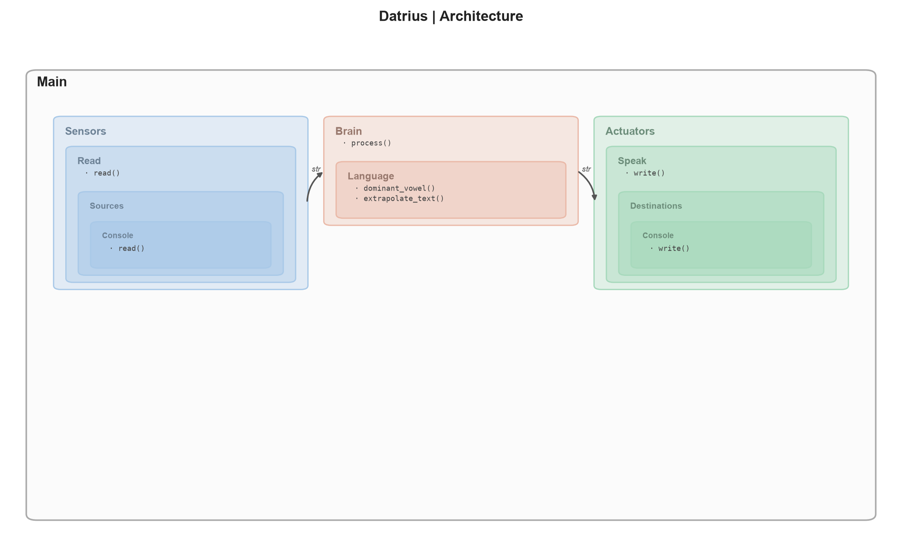

# Functionnal Logic

## General
- [sensors/function/](sensors) — one folder per sensory function = what is perceived.
    - **function/sources/** = physical/technical implementations.
    - **function/__init__.py** = single public interface returning normalized data, regardless of source.

- [brain/function/](brain) — one folder per cognitive function = how normalized data is processed. Operates only on data type, independent of its origin.
    - **brain/__init__.py** = central router. Receives normalized input, dispatches to the relevant function, returns output.

- [actuators/function/](actuators) — one folder per expressive function (what is produced).
    - **function/destinations/** = physical/technical implementations.
    - **function/__init__.py** = exposes a single public interface accepting normalized data.

- [visualisation/](visualisation) — observes internal state for development purposes, external to the sensors/brain/actuators loop.

### Naming rule
Every folder name states a function, never a physical medium. Implementation details tied to a medium live one level deeper, inside **sources/** or **destinations/**.